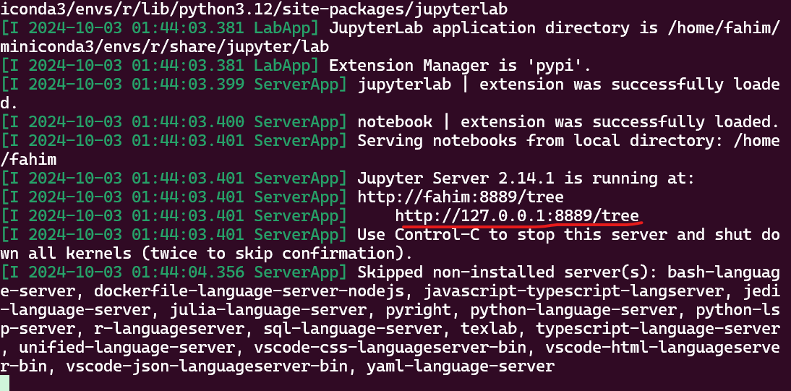
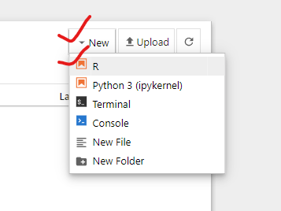
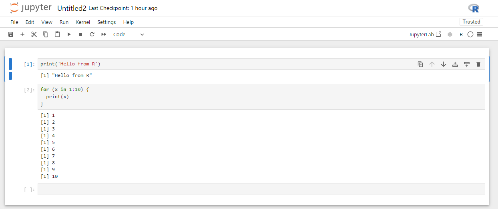

R is a popular programming language that’s now widely used in research-related fields like Bioinformatics.

And to use R, you’ll need to install the R Compiler and R Studio. But did you know that you can also directly run your R code right in a Jupyter Notebook? This helps in so many ways if you are already used to using Jupyter Notebook for Machine Learning-related tasks using Python.

In this tutorial, I’ll show you exactly how you can set up your local machine to run the R programming language directly in Jupyter Notebook. The processes I am going to show you today are equally applicable to all major operating systems (Windows, MacOS, and Linux OSes).

## Table of Contents

- [Install Conda](#install-conda)
- Create a New Environment
- Activate Your Conda Environment
- Install ipykernel and jupyter
- Install R in the Conda Environment
- Open the Jupyter Notebook
- Run R in Jupyter Notebook
- Conclusion

## Install Conda

You’d normally use Conda to handle multiple environments in Python. And here, we’re going to use the same Conda program to install R in our environment. You can either use [Anaconda](https://www.anaconda.com/) or [Miniconda](https://docs.anaconda.com/miniconda/).

I prefer Miniconda as it’s so lightweight. You’ll also get the opportunity to install the latest packages directly using Miniconda. But you can simply go with the Anaconda if you are already comfortable with that.

## Create a New Environment

Many people tend to use the Base environment. But I never like to use the Base environment directly as you typically need multiple environments for handling different package and versions of packages as well.

So I’ll create a new environment where I’ll work on my R programming language-related tasks using Jupyter Notebook.

To create a new Conda environment, simply use the following command:

```bash
conda create --name r-conda
```

Here, `r-conda` is my Conda environment’s name. You can choose any other name, but keep in mind that the conda env name can not have any whitespaces in it.

It will create a new Conda environment named `r-conda` for me.

## Activate Your Conda Environment

If you want to work on a separate conda environment, you’ll need to make sure that you’re activating that specific conda environment before starting to do anything.

I want to work on the `r-conda` conda environment. So I can simply activate the conda environment using the following command:

```bash
conda activate r-conda
```

You need to use the exact conda env name that you want if it’s different than `r-conda` in the command.

> [!NOTE]
> Keep in mind that you need to activate the conda environment successfully before proceeding further. You will see the conda environment’s name as `(conda-env-name)` at the left side of your terminal.


## Install `ipykernel` and `jupyter`

I always like to install the `ipykernel` and `jupyter` in all of my conda environments as they help manage different conda environments’ Jupyter notebooks/labs separately.

So I’m going to install them together in my conda env by using the command below:

```bash
conda install ipykernel jupyter
```

This will install both `ipykernel` and `jupyter` in the activated conda environment.

## Install R in the Conda Environment

To install R directly in the conda environment, simply use the following command:

```bash
conda install -c r r-irkernel
```

This will install the necessary components that enable your local computer to run the R program in your Jupyter Notebook.


## Open the Jupyter Notebook

Now you can open the Jupyter Notebook either by using `jupyter notebook` or `jupyter notebook --ip=0.0.0.0 --port=8889 --no-browser --allow-root --NotebookApp.token=''`. Just make sure to modify the IP, port, root configuration, and token as you see fit for your work.

Open the given link in the terminal to open Jupyter Notebook in your web browser.



## Run R in Jupyter Notebook

After opening Jupyter Notebook in your web browser, when you want to create a new notebook for R, you will get `R` directly in the “New” menu like the image given below.



Now, you can use the R language directly in your Jupyter Notebook!



You can also see the R programming language logo at the top right side of your Notebook.

## Conclusion

Thank you for reading the entire article. I hope you have learned something new here.

If you have enjoyed the procedures step-by-step, then don't forget to let me know on [Twitter/X](https://twitter.com/Fahim_FBA) or [LinkedIn](https://www.linkedin.com/in/fahimfba/). I would appreciate it if you could endorse me for some relevant skillsets on [LinkedIn](https://www.linkedin.com/in/fahimfba/). I would also recommend that you subscribe to my [YouTube channel](https://youtube.com/@FahimAmin) for regular programming-related content.

You can follow me on [GitHub](https://github.com/FahimFBA) as well if you are interested in open source. Make sure to check my [website](https://fahimbinamin.com/) as well.

Thank you so much! 😀